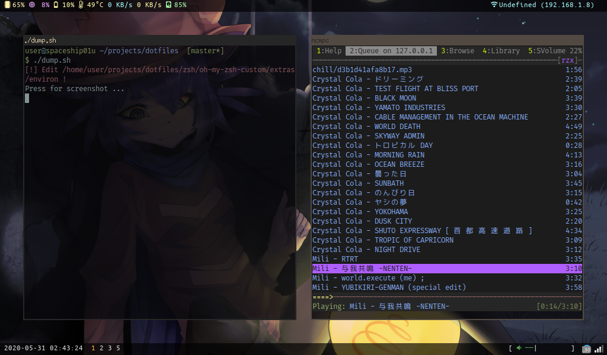

# dotfiles
I dunno, maybe name is the description ¯\\_(ツ)_/¯

## Credits
`nvim/init.nvim` based on [Vftdan/dotfiles](https://github.com/Vftdan/dotfiles/tree/master/editor/nvim)

## Unused dotfiles
 * `openbox` - I've migrated to i3, sooo.. yeah
 * `conky` - polybar is enough for me
 * `tint2` - same reason
 * `sxhkd` - i3 provides enough settings for me
 * `themes` - I'm not using openbox anymore
 * `rofi` - replaced with <a href="https://tools.suckless.org/dmenu">dmenu</a>

## Scrot:

  

